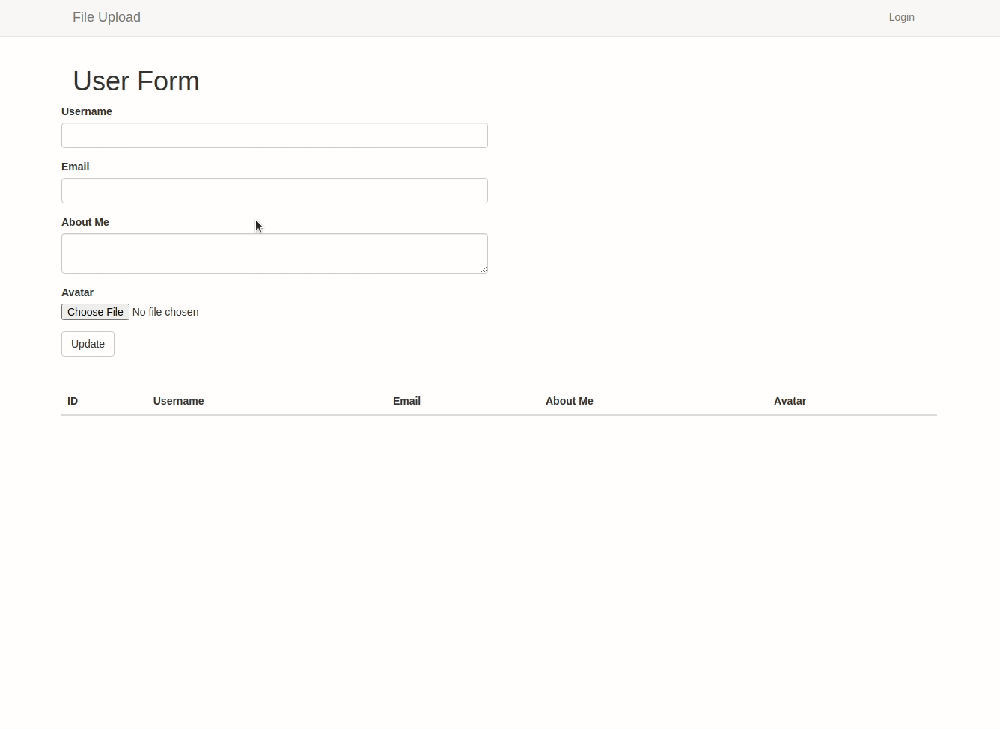

# Flask File Uploads

One feature of web applications is the ability to upload a file to an application. It is very common to see applications allow users to upload images for their avatar among other file types. This application shows how that feature can be implemented in Flask.



### Features

* File Upload

### Tools Used

* Flask Framework
* Twitter Bootstrap for styling
* Python3 for programming
* Flask-WTF for form creation

### Contributors
* [Gitau Harrison](https://github.com/GitauHarrison)

### Testing

To test the project, youcan clone this repo to your local machine by running the command below in your terminal:

```python
$ git clone git@github.com:GitauHarrison/handling-file-uploads-in-flask.git
```

Create and activate your virtual environment before running the flask server:

```python
$ mkvirtualenv file_upload  # I am using virtualenvwrapper 
```

Install used dependancies by running:

```python
(file_upload)$ pip3 install -r requirements.txt
```

Run the application:

```python
(file_upload)$ flask run
```

# Learn

If you would like to see how the application can be built from scratch, [here is an article](https://github.com/GitauHarrison/notes/blob/master/upload_files_to_database.md) you can refer to.

# References

- [Handling file uploads in flask](https://blog.miguelgrinberg.com/post/handling-file-uploads-with-flask/page/4#comments)